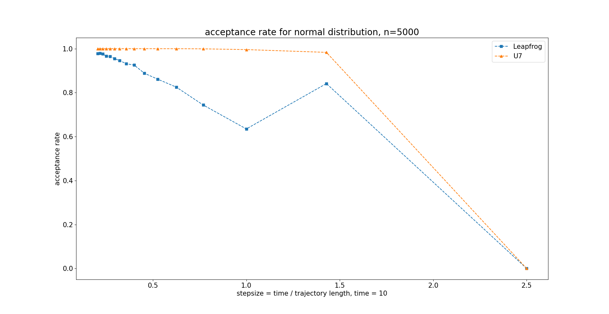

---
jupyter:
  jupytext:
    text_representation:
      extension: .md
      format_name: markdown
      format_version: '1.2'
      jupytext_version: 1.7.1
  kernelspec:
    display_name: Python 3
    language: python
    name: python3
---

# A more accurate integrator for HMC
Hamiltonian Monte Carlo (HMC) (TODO: link) is a very popular MCMC sampling algorithm, which crucially depends on an integration scheme to approximate Hamiltonian's equations of motion.  
In this blog post, we will learn more about integration schemes and discuss two different integrators:
The first one is the classical leapfrog, which is the standard method to generate new proposal states for HMC. The second integration scheme is the $U_7$, which is more accurate, but also computationally more expensive.  

In this blog post, we will first remind you of the basic idea of HMC and then expose you to some classical menchanics.
With these foundations set, we formally describe the two integrators and then tentatively compare the performance of corresponding HMC implementations.
In case you are new to HMC or MCMC methods, a good starting point might be Tweag's [blog post series](https://www.tweag.io/blog/2019-10-25-mcmc-intro1/). 


# Introduction
Broadly speaking the idea of HMC is that given a previous state $x$ of our Markov chain, we draw a random momentum $v$ from a normal distribution and simulate the behaviour of a fictive particle with starting point $(x,v)$. This intuition makes sense, because our probability density gives rise to a potential energy and vice versa, see [Simeon’ s blog post]( https://www.tweag.io/blog/2020-08-06-mcmc-intro3/). This deterministic behaviour is simulated for some fixed time $t$. The final state $(x^\star, v^\star)$ of the particle after some time t will then serve as the new proposal state of the Metropolis-Hastings algorithm.

You might wonder, why we can draw the initial momentum $v$ from a normal distribution. As can be seen the joint probability distribution
$$
\begin{align*}
 p(x,v) \propto & \,\exp \{-H(x,v)\} \\
= & \,\exp \{-K(v)\} \times \exp \{-E(x)\}\\
 =& \,\exp \{-\frac{|v|^2}{2} \} \times p(x).
\end{align*}
$$
Since we just multiply the two densities for $x$ and $v$, by definition, the two variables are independent from each other, therefore we can just sample $v$ independently of $x$. Moreover, it can be seen that the marginal distribution of $v$ is just the normal distribution up to some constant ($\propto$ means, that $A\propto B \iff A = kB$ for an arbitrary $k$).

The Hamiltonian is then given by $$H(x,v) = K(v) + E(x).$$ Usually, the Hamiltonian does not need to be of the form kinetic energy plus potential energy (separable), but it certainly makes things a lot easier and is a reasonable assumption for most use cases arising from Bayesian statistics and beyond. In fact, you can apply splitting methods, which we will do in the following, to nonseparable Hamiltonians as well, though some more math will be necessary. 

As mentioned above, the key concept of the HMC method is to simulate the fictive particle's dynamics. In terms of the Hamiltonian formalism, this is done by solving a set of differential equations, namely
$$
\frac{dx}{dt} = \frac{\partial H }{\partial v}, \hspace{15pt} \frac{dv}{dt}= -\frac{\partial H }{\partial x}.
$$
The notation can be simplified by introducing $z=(x,v)$. Then the Hamiltonian equations of motion can be rewritten in a single expression as 
$$
\dot{z} = \begin{pmatrix}\dot x \\ \dot v\end{pmatrix} = \begin{pmatrix}\frac{\partial H }{\partial v} \\ -\frac{\partial H }{\partial x}\end{pmatrix} = \{z,H(z)\}
$$
where $\{\cdot, \cdot \}$ is the [Poisson bracket](https://en.wikipedia.org/wiki/Poisson_bracket). The Poisson bracket is a differential operator of first order, which means, that it uses the first derivative. What the Poisson bracket essentially does is describe the change of any observable quantity with respect to the time evolution of a Hamiltonian system. Furthermore, by introducing an operator $D_{H\cdot} = \{ \cdot, H \}$, the equation can be further simplified to 
$$
\dot z = D_H z
$$
and is solved by
$$
z(t) = \exp ( t D_H) z(0) = \exp ( t(D_K + D_E)) z(0).
$$ 
Note that $D_K$ and $D_E$ stand respectively for the operators $\{ \cdot, K \}$ and $\{ \cdot, E \}.$
In general, the solution depends highly on the potential energy (which translates to the posterior distribution in the Bayesian setting) and can therefore be infeasible. 


## Splitting methods
In 1995 [Suzuki](http://people.ucalgary.ca/~dfeder/535/suzuki.pdf) proposed a new way to approximate expressions such as the solution of the Hamiltonian equations,
$$
\exp ( t(D_K + D_E)) = \prod_{i=1}^{k/2} \exp (c_i t D_K) \exp (d_i t D_E) + \cal{O}(t^{k+1}),
$$
where $\Sigma_{i=1}^k c_i = \Sigma_{i=1}^k d_i =1.$ You can think of this formula as a generalization of the identity $e^{m+n} = e ^m \cdot e^n.$ The error term is a result of the fact, that operators, such as matrices, generally do not commute. 

Each of the factors $\exp (c_i t D_K)$ will correspond to an update of the state $x$ and similarly $\exp (c_i t D_E)$ can be translated to an update of the momentum $v.$ [^1]

Imagine $(x^\star,v^\star)$ would be the exact solution after time $t$ and $(x_{t},v_{t})$ an approximation, then we would say, that the approximation is of n-th order and write $\mathcal{O}(t^n)$, if $||(x^\star,v^\star)-(x_{t},v_{t})||\leq C * t^n$ and $C$ is independent of the $t.$

Now, that we know how to come up with an approximation of the solution of the Hamiltonian equations, lets give a first example of one approximative algorithm:


## The Leapfrog

<!-- 
For now, let's come back to our fictive particle. As so often the differential eqaution is actually not always analytically tractable and so we need a way to approximate the behaviour of our fictive particle. And this is where the leapfrog method comes into play. 
--> 
The intuition is, that we update the space coordinate $x$ and the momentum variable $v$ one after another multiple times. This behaviour is the reason for the name *Leapfrog*.


More rigorously, the updates look like the following,
$$
x_{i+1}= x_n +   v_{i + 1/2} \Delta t
$$
$$
v_{i + 3/2} = v_{i+1/2} + \left(-\frac{\partial}{\partial x} E(x_{i+1})\right) \Delta t
$$

As you might have noticed, you need to perform half a step for the momentum in the beginning and the end. 
So, in terms of Suzuki, the Leapfrog looks like this
$$
\text{Leapfrog} =  U_3 U_3 \cdots U_3, 
$$
where 
$$
U_3 = \exp (\frac {1}{2}\Delta t D_E)\exp (\Delta t D_K)\exp (\frac {1}{2}\Delta t D_E).
$$
The coefficients are $c_1 = 0,\, c_2 = 1,\, d_1=d_2 = \frac{1}{2}.$

If we further divide our time $t$ into $t = stepsize * trajectory\_length$ and apply the Suzuki approximation $U3$ $trajectory\_length$-times, then a small function, approximating the desired behaviour for some time $t$, would have the following look:

```python
def integrate(x, v):

    v += 1./2 * stepsize * -gradient_pot_energy(x)

    for i in range(trajectory_length-1):
        x += stepsize * v
        v += stepsize * gradient_pot_energy(x)

    x += stepsize * v
    v += 1./2 * stepsize * gradient_pot_energy(x)

    return x, v
```

You might wonder, why should we look further, if we have found a sufficiently exact approximation of what we desired. We can always diminish the error by shortening the $stepsize$ and increasing the $trajectory\_length.$

Well, one answer might simply be, what if there is a more efficient way. But secondly, the Leapfrog is already not exact even for constant force $- \nabla E = \text{const.}$

Evolutionary, that is why first a five-factor approximation was considered by [Chau et al.](https://iopscience.iop.org/article/10.1088/1367-2630/aacde1/pdf). Unfortunately, this approximation has still error terms of third order. And this in turn was reason for the development of:


## The $U_7$
The novelty of the $U_7$ consists of the usage of the second order derivative of the potential energy. This comes along with a few more updates of $x$ and $v$ per step and yields a lower error. 

The $U_7$ approximation was first discovered in [https://reader.elsevier.com/reader/sd/pii/S0375960197000030?token=7FF329D99F3F86911490FC7261984FF7C3F0C78AF8E8ECA9171C9F6A79F55FEBC5F0A132532C09AA45A4B1061464514E&originRegion=eu-west-1&originCreation=20210617130838], reconsidered in [https://arxiv.org/pdf/cond-mat/0111055.pdf], but later independently obtained through an entirely different approach in [Chau et al.](https://iopscience.iop.org/article/10.1088/1367-2630/aacde1/pdf).

In [this paper](https://arxiv.org/pdf/2007.05308.pdf) Jun Hao Hue et al. benchmark the performance of the leapfrog and $U_7$ against various classical and quantum systems, but are not concerned with their use in HMC.

Concretely, the $U_7$, as the name suggests, is in the work of [Chau et al.](https://iopscience.iop.org/article/10.1088/1367-2630/aacde1/pdf) a seven factor approximation. The usage of a special [property](https://iopscience.iop.org/article/10.1088/1367-2630/aacde1/pdf)made it possible to reduce three factors to one, making it a five factor approximation. Because this derivation uses quantum mechanical characteristics, I want to present a more intuitive way, how the U7 can be derived.

One way to think about this is, that when we want to apply $e ^A \cdot e^B \cdot e^C= e^{A+B+C}$ to operators we remember that we must take into account, that they do not commute. So, this identity does not hold in the general case, but what we can do is use a series expansion, which, similar to a Taylor expansion, involves higher order derivatives. To verify this, check out [Siu A. Chin work](https://www.sciencedirect.com/science/article/pii/S0375960197000030). Then cutting off the expansion leaves us with an additional error, but even though we could reduce the number of factors, the approximation remains an accuracy with error order $\cal{O}(t^5)$. Consequently, the $U_7$ is exact up to fourth order and is therefore said to be a fourth-order approximation.[^2] 

Either or, the newly formed term, involes the second order derivative and thus the $U_7$ factorization is given by

$$U_7 = \exp (\frac {1}{6}t D_E)\exp (\frac {1}{2}t D_K)\exp (\frac {2}{3}t D_\tilde{V})\exp ( \frac {1}{2}t D_K)\exp (\frac {1}{6}t D_E),$$

whereas $D_\tilde V = \{\cdot , V + \frac{1}{48}[t\nabla V ]^2\}.$ 

A simplified python method of the algorithm described above would look like this:

```python
def integrate(x, v):

    v += 1./6 * stepsize * gradient_pot_energy(x)

    for i in range(trajectory_length-1):
        x += 1./2 * v * stepsize
        v += (2./3 * stepsize * (gradient_pot_energy(x)
            + stepsize**2./24
            * np.matmul(hessian_log_prog(x),gradient_pot_energy(x))))
        x += 1./2 * v * stepsize
        v += 1./3 * stepsize * gradient_pot_energy(x)

    x += 1./2 * v * stepsize
    v += (2./3 * stepsize * (gradient_pot_energy(x)
        + stepsize**2./24
        * np.matmul(hessian_log_prog(x),gradient_pot_energy(x))))
    x += 1./2 * v * stepsize
    v += 1./6 * stepsize * gradient_pot_energy(x)

    return x, v
```

Bare in mind, that the higher accuracy, achieved with the $U_7$, comes along with a non-negligible, additional computational cost. 

Note also, the longer the stepsize, the larger the error and the less likely the acceptance of the proposed state for the MCMC algorythm.


## Benchmarking leapfrog and U7-based HMC
To compare the performance of the leapfrog and U7 integration schemes in the context of HMC, we plug above implementations into HMC and sample from two different probability distributions.

The first example is a 100-dimensional standard normal distribution.
Because of the high symmetry of this distribution, we have to be careful to not compare apples and oranges:
if we integrate for different total times, the trajectory might double back and we would waste computational effort (TODO: link or explanation).
We thus fix the total integration time (given by `number of integration steps x time step`) to ten time units and run HMC for different combinations of time step and number of integration steps.
If we can use a higher stepsize, we have to perform less integration steps, which means less costly gradient and Hessian evaluations.





We find indeed that the acceptance rate stays almost constant at almost one for a wide range of time steps, while the HMC implementation based on the leapfrog integration scheme shows rapidly diminishing acceptance rates.
This confirms that we have implemented the U7 integrator correctly and makes us even more excited to test it on a "real" system!


summary: hessian sparse Zeitgewinn


## Footnotes
1. This algorythm in operator notation has a quite simple representation in canonical coordinates. Since $D_K^2 z = \{\{z,K\}K\} = \{(\dot  x, 0), K  \} = (0,0)$, the taylor expansion of $\exp (a D_K) $ reduces to $\Sigma_{n=0}^{\infty} \frac{(a D_K)^n}{n!} = 1+ aD_K$. This in turn makes $\exp(\beta_i t D_K)$ the mapping $$\begin{pmatrix}x \\v\end{pmatrix} \mapsto \begin{pmatrix}x + t \beta_i \frac{\partial K}{\partial v} (v)\\v\end{pmatrix}$$ and $\exp(\beta_i t D_K)$ gives $$\begin{pmatrix}x \\v\end{pmatrix} \mapsto \begin{pmatrix}x \\v - t \beta_i \frac{\partial E}{\partial x} (x)\end{pmatrix}.$$ 
2. One interesting remark is that, for symmetric approximations, $U(t)U(-t) = 1$, the error terms can't be of even order since then, intuitively speaking, the error would point in the same direction, because $t^{2n} = (-t)^{2n}$. 


<!--
#### But wait!

I dont want to loose any of you right on the spot, just because I used the term differential equation. It is actually much simpler than that, so don't worry. Just let me show you one simple remarkable result.

In our case of the seperable Hamiltonian, we can rewrite the differential equations, by just using the terms, that are actually dependend on the variable, we want to take the derivativ of, so
$$\frac{dx}{dt} = \frac{\partial}{\partial v} K(v) = \frac{v}{m}, \hspace{15pt} \frac{dv}{dt}= -\frac{\partial}{\partial x} E(x).$$

This might look already much more familiar to you. Just multiply the left equation with m and take once more the derivate with respect to $t$ gives us $m\frac{d^2x}{dt^2}  = \frac{dv}{dt}.$ This then plugt into the second equation 
$$m\frac{d^2x}{dt^2}  = \frac{dv}{dt} = -\frac{\partial}{\partial x} E(x) = F$$
leaves us with Newton's beautiful second law of motion.

-->
footnote

```python

```
